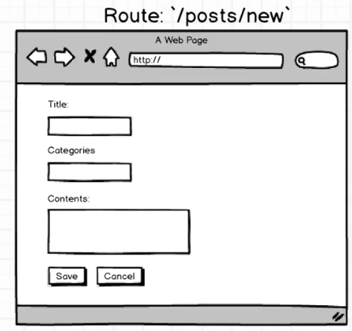

###### A user can create a new post
* scaffold out the component used to create form
* add component to routes file as a new url

> we added a new route for the new post
> PostNew was created to be the new post component

* implement a button in the post index component
* Add the `form` to the PostNew component
  * when user submits it should call an actionCreator to save blog post
* create the ActionCreator and update our reducer

<br><br><br>
We installed redux-forms
* first we tell reduxForm what it is in charge of
  * we wrap the Component
  * we give the form a name (unique for potential multiple forms)
  * we give it fields
```
export default reduxForm({
  form: 'PostNewForm',
  fields: ['title', 'categories', 'content']
})(PostNew);
```

```
const {handleSubmit} = this.props;
const {title, categories, content} = this.props.fields;
console.log(title);
```
handleSubmit a property of props because of 'reduxForm'<br>
`<form onSubmit={this.handleSubmit}>`

'spread' form, categories, and content in the input fields
`<input type="text" className="form-control" {...categories} />`
