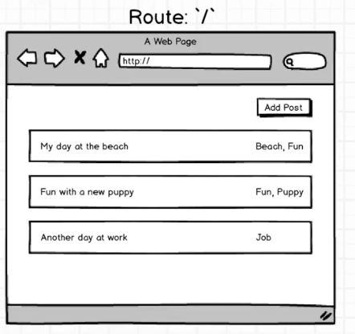
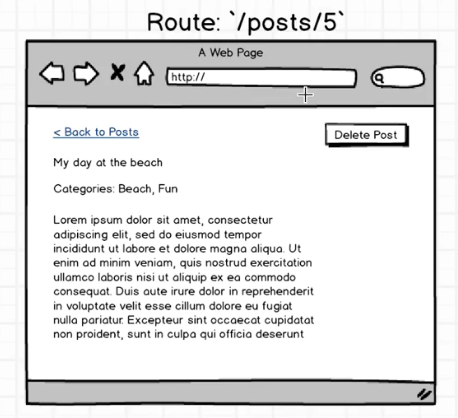
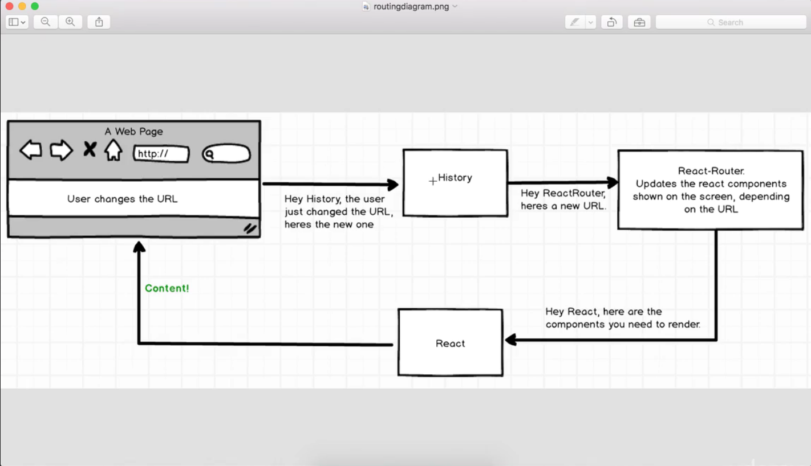

Routes can be nested like:
```
  <Route path="/" component={App}>
    <Route path="greet" component={Greeting} />
    <Route path="greet2" component={Greeting} />
  </Route>
```

* In order to see nested routes you must:
  * {this.props.children} in target component
* IndexRoute to load "/" as with child component.
  * allows header, footer and other surroundings.



* A add post button
* A list of blog posts

create posts_index.js





